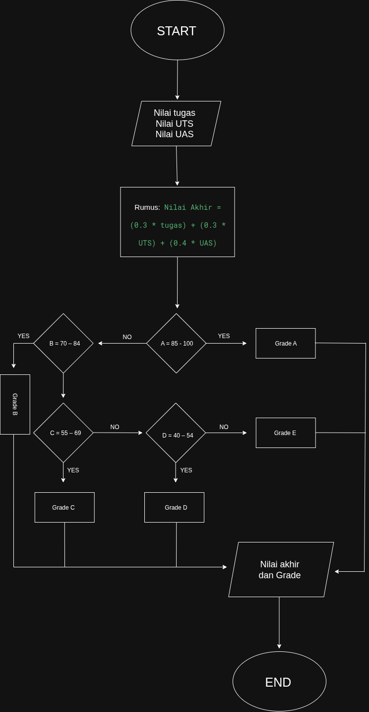

ALGORITMA

    1.Mulai
    2.Input hasil nilai:
        -Tugas
        -UTS    
        -UAS
    3.Menghitung nilai akhir
    4.Menentukan grade setiap nilai
    5.Tampilkan nilai akhir dan memberikan grade pada masing masing nilai
        menentukan grade:
            A = 85 – 100
            B = 70 – 84
            C = 55 – 69
            D = 40 – 54 
            E = < 40
    5.Selesai

PSEUDOCODE

    INPUT tugas
    INPUT uts
    INPUT uas

    nilaiAkhir ← (0.3 * tugas) + (0.3 * uts) + (0.4 * uas)

    Jika nilaiAkhir >= 85 Dan nilaiAkhir <= 100 THEN
        grade ← "A"
    Jika nilaiAkhir >= 70 Dan nilaiAkhir <= 84 THEN
        grade ← "B"
    Jika nilaiAkhir >= 55 Dan nilaiAkhir <= 69
        grade - "c"
    Jika nilaiAkhir >= 40 Dan nilaiAkhir <= 54
        grade - "D"
    jika nilaiAkhir 
        grade - "E"
        
    OUTPUT "Nilai Akhir = ", nilaiAkhir
    OUTPUT "Grade = ", grade
SELESAI

FLOWCHART

